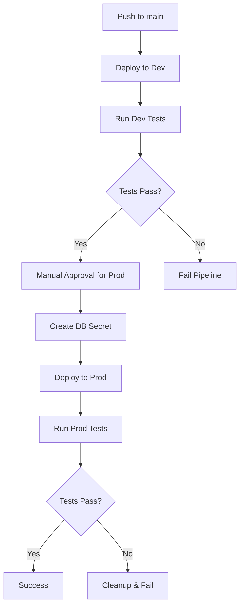

# Deployment Guide

This document describes how to deploy the FastAPI Challenge application using the automated pipelines.

## Pipeline Overview

The deployment process uses two main workflows:

1. **Deploy Pipeline** (`.github/workflows/deploy.yaml`) - Deploys the application
2. **Destroy Pipeline** (`.github/workflows/destroy.yaml`) - Tears down deployments

## Required GitHub Secrets

Before running the pipelines, configure these secrets in your GitHub repository:

### Repository Secrets

| Secret Name | Description | Example |
|-------------|-------------|---------|
| `KUBE_CONFIG` | Base64 encoded kubeconfig file | `cat ~/.kube/config \| base64` |
| `PROD_DB_PASSWORD` | Production database password | `super-secure-prod-password-123` |

### Setting Up Secrets

1. Go to your GitHub repository
2. Navigate to **Settings** → **Secrets and variables** → **Actions**
3. Click **New repository secret**
4. Add each secret with the appropriate values

## Deployment Process

### Automatic Deployment

The pipeline automatically deploys to development when:
- Code is pushed to the `main` branch
- Changes are made to `infra/`, `app/`, or `Dockerfile`

### Manual Deployment

You can trigger deployments manually:

1. Go to **Actions** tab in your GitHub repository
2. Select **Deploy FastAPI Challenge** workflow
3. Click **Run workflow**
4. Choose the environment (`dev` or `prod`)

## Environment Details

### Development Environment

- **Namespace**: `fastapi-challenge-dev`
- **Replicas**: 1
- **Resources**: Minimal (100m CPU, 128Mi memory)
- **Ingress**: Disabled (use port-forward)
- **Database**: Plain text password in values file
- **Auto-deployment**: ✅ On every push to main

### Production Environment

- **Namespace**: `fastapi-challenge`
- **Replicas**: 3 (with autoscaling 3-10)
- **Resources**: Production-grade (250m-1000m CPU, 256Mi-1Gi memory)
- **Ingress**: Enabled with TLS
- **Database**: Kubernetes secret from GitHub secret
- **Auto-deployment**: ✅ On push to main (with manual approval)

## Pipeline Flow



## Manual Operations

### Local Development

```bash
# Deploy to dev locally
cd infra/terraform
task dev

# Port forward to access
task port-forward ENV=dev

# Check status
task status ENV=dev

# View logs
task logs ENV=dev
```

### Production Operations

```bash
# Deploy to prod (requires secret setup)
PROD_DB_PASSWORD="your-password" task create-secret ENV=prod
task prod

# Test deployment
task test ENV=prod
```

## Monitoring and Verification

### Automatic Checks

The pipeline automatically:
- ✅ Waits for pods to be ready
- ✅ Tests all endpoints (`/`, `/data`, `/items/42`)
- ✅ Verifies expected responses
- ✅ Checks replica counts match expectations

### Manual Verification

After deployment, you can verify:

```bash
# Check pods are running
kubectl get pods -n fastapi-challenge-dev  # or fastapi-challenge for prod

# Test endpoints
kubectl port-forward -n fastapi-challenge-dev svc/fastapi-challenge-dev-fastapi-challenge 8080:8080
curl http://localhost:8080/
curl http://localhost:8080/data
```

## Troubleshooting

### Common Issues

1. **Secret Not Found**
   - Ensure `PROD_DB_PASSWORD` secret is set in GitHub
   - Check that the secret exists in Kubernetes: `kubectl get secret db-password -n fastapi-challenge`

2. **Kubeconfig Issues**
   - Verify `KUBE_CONFIG` secret is properly base64 encoded
   - Test locally: `echo "$KUBE_CONFIG" | base64 -d > test-config && kubectl --kubeconfig=test-config get nodes`

3. **Image Pull Errors**
   - Ensure the Docker image exists: `docker pull arho0/fastapi-challenge:latest`
   - Check if the image tag in values files matches published images

4. **Resource Limits**
   - Monitor resource usage: `kubectl top pods -n fastapi-challenge`
   - Adjust resource limits in values files if needed

### Pipeline Failures

If a pipeline fails:

1. **Check the logs** in the GitHub Actions tab
2. **Review the step that failed** for specific error messages
3. **Common fixes**:
   - Re-run the workflow if it was a transient issue
   - Check secrets are properly configured
   - Verify kubeconfig has necessary permissions

### Cleanup

To destroy environments:

1. Go to **Actions** → **Destroy FastAPI Challenge**
2. Choose environment (`dev`, `prod`, or `both`)
3. Type `destroy` in the confirmation field
4. Run the workflow

## Security Considerations

- 🔒 Production passwords are stored as GitHub secrets
- 🔒 Kubernetes secrets are created at runtime, not stored in Git
- 🔒 Manual approval required for production deployments
- 🔒 Separate environments with proper RBAC
- 🔒 TLS enabled for production ingress

## Best Practices

1. **Always test in dev first** before promoting to production
2. **Use specific image tags** for production (not `latest`)
3. **Monitor resource usage** and adjust limits as needed
4. **Keep secrets rotated** regularly
5. **Review deployment changes** in pull requests before merging